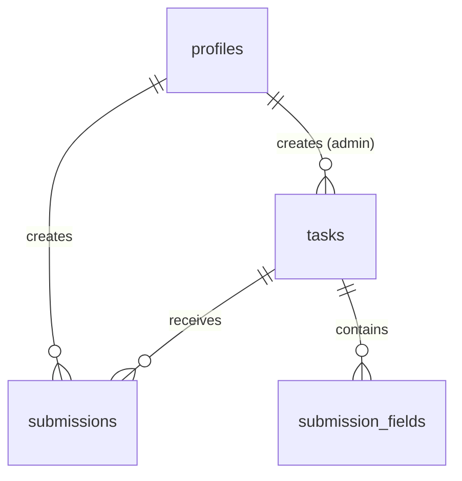

# MLSA SRM Recruitment Portal

<div align="center">

[](https://nextjs.org/)
[](https://www.typescriptlang.org/)
[](https://supabase.com/)
[](https://ai.google.dev/)
[](https://tailwindcss.com/)
[](https://opensource.org/licenses/MIT)

**AI-Powered Club Recruitment Platform**

*Streamlining club recruitment with intelligent automation and seamless user experience*

[🚀 Live Demo](https://recruitment-portal.vercel.app) • [📖 Documentation](https://docs.recruitment-portal.com) • [🐛 Report Bug](https://github.com/MLSA-SRM/recruitment-portal/issues) • [✨ Request Feature](https://github.com/MLSA-SRM/recruitment-portal/issues)

---

</div>

## 📋 Table of Contents

- [🎯 Overview](#-overview)
- [✨ Features](#-features)
- [🛠️ Tech Stack](#️-tech-stack)
- [🚀 Quick Start](#-quick-start)
- [📁 Project Structure](#-project-structure)
- [🤖 AI Integration](#-ai-integration)
- [🗄️ Database Schema](#️-database-schema)
- [🔌 API Reference](#-api-reference)

---

## 🎯 Overview

The **MLSA SRM Recruitment Portal** is a comprehensive, AI-powered platform designed to streamline the recruitment process for Microsoft Student Accelerator (MSA) at SRM University. Built with modern web technologies and powered by Google Gemini AI, it provides intelligent automation for task management, submission review, and candidate evaluation.

### 🎯 Key Objectives

- **Automate Recruitment**: Reduce manual effort in reviewing applications
- **Intelligent Evaluation**: AI-powered scoring and feedback system
- **Enhanced UX**: Modern, responsive interface for all users
- **Scalable Architecture**: Built to handle high-volume recruitment cycles
- **Data-Driven Insights**: Analytics and reporting for recruitment teams

---

## ✨ Features

### 👥 For Applicants

| Feature | Description | Benefits |
|---------|-------------|----------|
| **Smart Task Discovery** | Filter by domain, subdomain, and target year | Find relevant opportunities quickly |
| **Flexible Submissions** | GitHub repos, portfolios, documents, and custom fields | Submit work in preferred format |
| **AI-Powered Feedback** | Instant scoring and detailed review | Get constructive feedback immediately |
| **Progress Tracking** | Real-time status updates and notifications | Stay informed about application status |
| **Personal Dashboard** | View all submissions and feedback history | Track progress across multiple applications |

### 🔧 For Administrators

| Feature | Description | Benefits |
|---------|-------------|----------|
| **Task Management** | Create and manage recruitment positions | Customize requirements and deadlines |
| **AI Review System** | Automated scoring with detailed feedback | Consistent, unbiased evaluation |
| **Advanced Filtering** | Filter by year, domain, status, and scores | Efficient candidate screening |
| **Analytics Dashboard** | Real-time insights and statistics | Data-driven recruitment decisions |
| **Bulk Operations** | Export shortlisted candidates as CSV | Streamline final selection process |
| **Real-time Notifications** | Instant alerts for new submissions | Stay updated on application activity |

### 🔒 Security & Privacy

- **Row Level Security (RLS)**: Database-level access control
- **Role-based Access**: Separate permissions for applicants and admins
- **Secure Authentication**: Supabase Auth integration
- **Encrypted Storage**: All data encrypted in transit and at rest
- **Privacy Compliance**: GDPR-ready data handling

---

## 🛠️ Tech Stack

### 🎨 Frontend
- **Framework**: Next.js 15.5.2 (App Router)
- **Language**: TypeScript 5.0+
- **Styling**: Tailwind CSS 4.0
- **UI Components**: Shadcn/ui + Radix UI
- **Icons**: Lucide React
- **Forms**: React Hook Form + Zod validation

### ⚙️ Backend & Database
- **Backend**: Next.js API Routes
- **Database**: Supabase (PostgreSQL)
- **Authentication**: Supabase Auth
- **Real-time**: Supabase Realtime
- **Storage**: Supabase Storage

### 🤖 AI & External APIs
- **AI Model**: Google Gemini 1.5 Flash
- **GitHub Integration**: Octokit
- **Web Scraping**: Cheerio
- **Data Processing**: PapaParse (CSV)

### 🛠️ Development Tools
- **Linting**: ESLint 9
- **Type Checking**: TypeScript
- **Environment**: T3 Env
- **Package Manager**: Yarn

---

## 🚀 Quick Start

### 📋 Prerequisites

| Requirement | Version | Description |
|-------------|---------|-------------|
| Node.js | 18+ | JavaScript runtime |
| Yarn | 1.22+ | Package manager |
| Supabase Account | Latest | Database & Auth |
| Google AI API Key | Latest | Gemini API access |

### 🔧 Installation

1. **Clone the repository**
   ```bash
   git clone https://github.com/MLSA-SRM/recruitment-portal.git
   cd recruitment-portal
   ```

2. **Install dependencies**
   ```bash
   yarn install
   ```

3. **Environment Setup**
   ```bash
   cp .env.local.example .env.local
   ```

Configure your environment variables:
   ```env
   # Supabase Configuration
   NEXT_PUBLIC_SUPABASE_URL=your_supabase_project_url
   NEXT_PUBLIC_SUPABASE_ANON_KEY=your_supabase_anon_key

   # AI & External APIs
   GEMINI_API_KEY=your_gemini_api_key
   GITHUB_TOKEN=your_github_personal_access_token

   # Optional: Analytics, Monitoring, etc.
   NEXT_PUBLIC_APP_URL=http://localhost:3000
   ```

4. **Database Setup**
   ```bash
   # Run Supabase migrations
   npx supabase db push
   ```

5. **Start Development Server**
   ```bash
   yarn dev
   ```

Your app will be available at http://localhost:3000

### 📜 Available Scripts
   
```bash
# Development
yarn dev          # Start development server
yarn build        # Build for production
yarn start        # Start production server
yarn lint         # Run ESLint

# Database
yarn db:push      # Push schema changes
yarn db:reset     # Reset database
yarn db:seed      # Seed with sample data
```

---

## 📁 Project Structure

```
recruitment-portal/
├── src/
│   ├── app/                    # Next.js App Router
│   │   ├── admin/             # Admin dashboard pages
│   │   │   ├── dashboard/     # Analytics & overview
│   │   │   ├── tasks/         # Task management
│   │   │   ├── submission/    # Submission review
│   │   │   └── export/        # Data export
│   │   ├── api/               # API routes
│   │   │   ├── submissions/   # Submission endpoints
│   │   │   ├── tasks/         # Task endpoints
│   │   │   └── submission-status/ # Status updates
│   │   ├── auth/              # Authentication pages
│   │   ├── apply/             # Application pages
│   │   ├── dashboard/         # User dashboard
│   │   └── profile/           # Profile management
│   ├── components/            # Reusable components
│   │   ├── ui/               # Shadcn/ui components
│   │   ├── admin-layout.tsx  # Admin layout wrapper
│   │   ├── navigation.tsx    # Navigation component
│   │   └── skeleton-*.tsx    # Loading components
│   └── lib/                  # Utilities & configurations
│       ├── ai.ts            # AI integration
│       ├── supabase.ts      # Database client
│       ├── types.ts         # TypeScript definitions
│       ├── constants.ts     # App constants
│       └── utils.ts         # Helper functions
├── supabase/                 # Database migrations
│   └── migrations/          # SQL migration files
├── public/                  # Static assets
└── Configuration files      # package.json, tsconfig.json, etc.
```

---

## 🤖 AI Integration

### 🧠 Intelligent Review System

The platform uses **Google Gemini 1.5 Flash** for automated submission evaluation with specialized prompts for different submission types:

#### 📊 Evaluation Criteria

| Submission Type | Focus Areas | Key Metrics |
|----------------|-------------|-------------|
| **Technical (1st Year)** | Fundamentals, effort, learning potential | Code quality, functionality, documentation |
| **Technical (2nd Year)** | Architecture, best practices, task compliance | Framework usage, performance, deployment |
| **Corporate** | Business suitability, strategic thinking | Feasibility, clarity, persuasion, creativity |

#### 🎯 Scoring Algorithm

- **Technical Proficiency**: 40% weight
- **Code Quality**: 30% weight  
- **Documentation**: 15% weight
- **Innovation**: 15% weight

#### 📈 Score Interpretation

| Score Range | Performance Level | Action Required |
|-------------|-------------------|----------------|
| 900-1000 | Exceptional | Immediate shortlist |
| 800-899 | Excellent | Strong candidate |
| 700-799 | Good | Review required |
| 600-699 | Average | May need improvement |
| < 600 | Below Average | Requires significant work |

### 🔍 Advanced Features

- **URL Validation**: Intelligent detection of legitimate vs. placeholder submissions
- **Content Analysis**: Detection of AI-generated or template content
- **Flexible Evaluation**: Handles mixed-quality submissions gracefully
- **Structured Output**: JSON-formatted responses for consistent parsing

---

## 🗄️ Database Schema

### 📋 Core Tables

| Table | Purpose | Key Fields |
|-------|---------|------------|
| `profiles` | User information | id, name, email, department, year, is_admin |
| `tasks` | Recruitment positions | id, title, description, domain, deadline |
| `submissions` | User applications | id, task_id, applicant_id, status, ai_score |
| `submission_fields` | Custom form fields | id, task_id, field_name, field_type, is_required |

### 🔐 Security Model

| Policy Type | Scope | Permissions |
|-------------|-------|-------------|
| User Profiles | Own data only | Read, Update |
| Submissions | Own submissions | Read, Create |
| Tasks | All users | Read |
| Admin Access | All data | Full CRUD |

### 🔄 Key Relationships



---

## 🔌 API Reference

### 🎯 Core Endpoints

| Method | Endpoint | Description | Access |
|--------|----------|-------------|---------|
| `POST` | `/api/submissions` | Submit application | Authenticated users |
| `GET` | `/api/submissions/:id` | Get submission details | Owner/Admin |
| `PUT` | `/api/submissions/:id/status` | Update status | Admin only |
| `GET` | `/api/tasks` | List available tasks | All users |
| `POST` | `/api/tasks` | Create new task | Admin only |
| `GET` | `/api/admin/export` | Export candidates CSV | Admin only |
| `POST` | `/api/submissions/:id/trigger-ai` | Trigger AI review | Admin only |

### 🔐 Authentication

- **Bearer Token**: Supabase JWT in Authorization header
- **Session-based**: Automatic via Supabase client
- **Role-based**: Admin endpoints require `is_admin: true`

### 📝 Request/Response Examples

#### Submit Application
```typescript
POST /api/submissions
{
  "task_id": 123,
  "submission_data": {
    "github_url": "https://github.com/user/repo",
    "description": "Project description"
  }
}
```

#### AI Review Response
```typescript
{
  "score": 850,
  "review": "## Code Review - Excellent Implementation\n\n### Summary\nWell-structured React application with modern practices...",
  "recommendation": "shortlist"
}
```